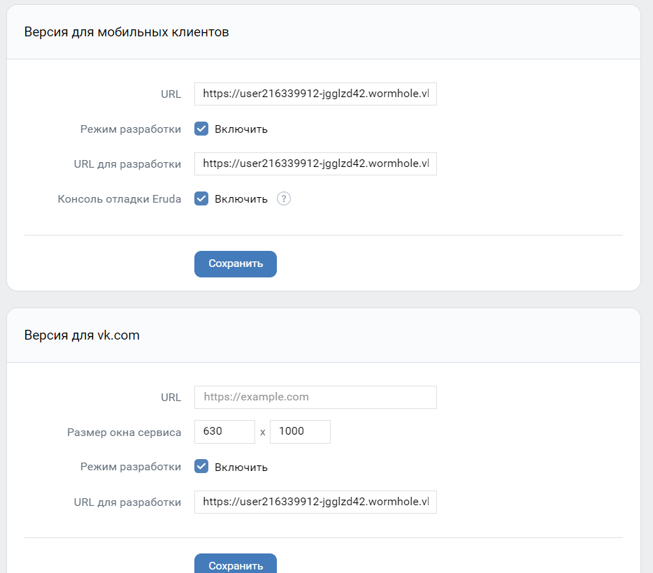
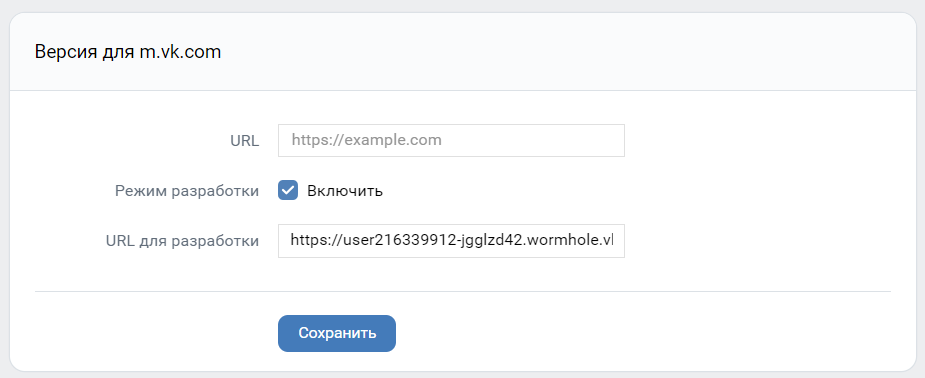

## Деплой проекта в VK

### 1) Запуск проекта

```bash
    npm run tunnel — запуск туннеля
```

После в терминале появится сссылка на задеплоеный проект на сервере VK вида:

https://user216339912-ibf4dgae.wormhole.vk-apps.com/

### 2) Настройка приложения в VK

2.1) Переходим по ссылке: https://vk.com/editapp?id=51767548&section=options.
Перейти можно будет только, если ты являешься администратором / владельцем приложения

2.2) Копируем ссылку из терминала и вставляем ее в данные поля:





2.3) Нажимаем на сохранить в любом блоке — данные сохранятся во всех блоках одновременно.

### 3) TODO: Деплой на собственном серваке данного туннеля